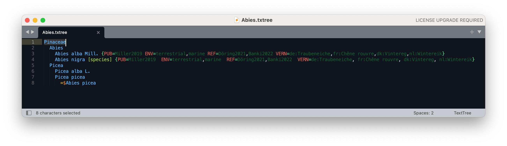
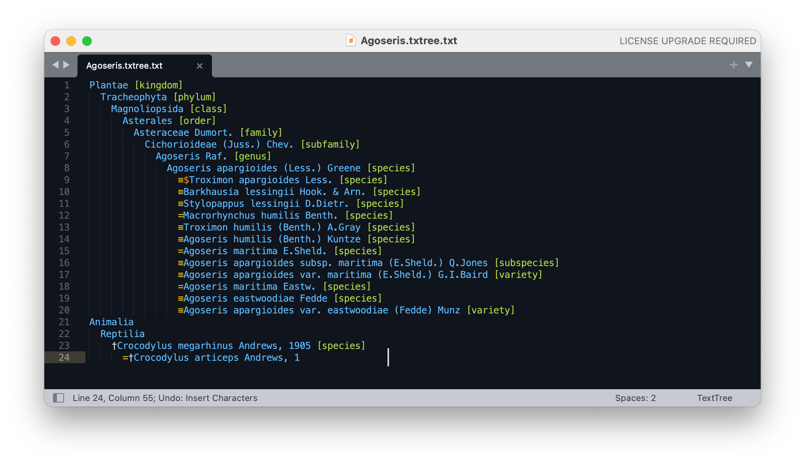

# text-tree-sublime
[Sublime Text](https://www.sublimetext.com) editor package for the [TextTree](https://github.com/gbif/text-tree) syntax.

TextTree is a simple format to represent taxonomic trees with scientific names using indented, plain text.
It is recommended to use the file extension `.txt` or `.txtree`.

## Syntax highlighting
This TextTree sublime package defines syntax highlighting for the tree itself and the optional structured information:

